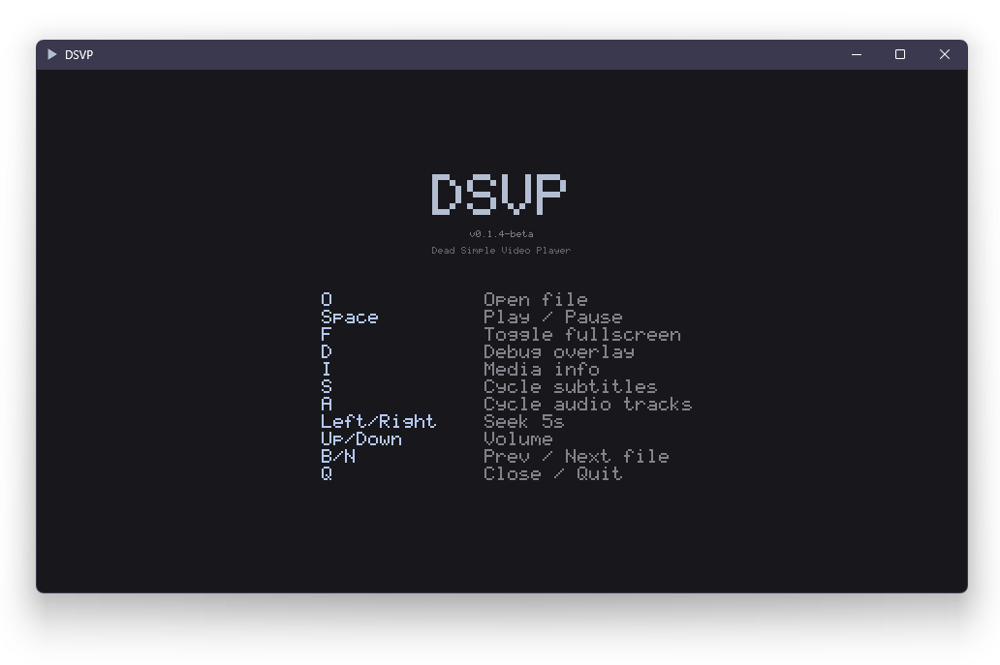

# DSVP_deck — Dead Simple Video Player optimized for the Steam Deck




WHY? Because I can. And education. And I'm a config-fiddler that wanted to offer a mpv-style player without configs or intimidation factor. Think of DSVP as a middle-man between VLC and mpv. It's not as SOTA as mpv but should be more "user-friendly". Or less, if you don't have a  keyboard. Should offer better quality than VLC as it uses more modern FFmpeg libraries. It *should* play anything you throw at it.

There are portable Windows & Debian builds on the [main branch](https://github.com/ASIXicle/DSVP/tree/main). Steam Deck builds are on this branch — download the latest tarball from [Releases](https://github.com/ASIXicle/DSVP/releases/).

Claude wrote most of this:

---


## Features

- **Reference-quality playback** — Lanczos-2 luma scaling (anti-ringing clamp), Catmull-Rom chroma upsampling (siting-corrected), temporal blue noise dithering, faithful color/gamma/framerate
- **HDR→SDR tone mapping** — BT.2390 EETF with dynamic scene-adaptive peak detection (99.875th percentile histogram, temporal smoothing), adjustable SDR target (203/300/400 nits) and midtone gain
- **Dolby Vision** — Profile 5 decode with per-frame RPU updates and per-component affine reshaping; Profile 8 falls through to standard HDR10 path
- **10-bit passthrough** — YUV420P10LE content uploads as R16_UNORM planar textures with no truncation
- **VAAPI hardware decode** — HEVC content decoded on the Deck's VCN hardware (bit-exact P010 output), freeing CPU for demux and audio
- **VAAPI zero-copy** — DMA-BUF→Vulkan interop eliminates GPU readback for HEVC 10-bit content, zero sustained drops on 4K
- **Supports everything FFmpeg supports** — H.264, HEVC, AV1, VP9, VC-1, MKV, MP4, and hundreds more
- **Adaptive thread tuning** — per-codec/per-file thread selection optimized for the Deck's 4C/8T Zen 2
- **Full subtitle support** — text (SRT, ASS/SSA), bitmap (PGS, VobSub), CJK fallback fonts, golden yellow with black outline, cycle tracks with `S`
- **Folder navigation** — `B`/`N` keys to jump between media files in the current folder, with clickable prev/next buttons
- **Portable** — single folder, no installer, no root required, survives SteamOS updates
- **Secure** — no networking capabilities whatsoever
- **Cross-platform** — Vulkan on Windows/Linux/Deck, Metal on macOS

## Controls

| Key | Action |
|---|---|
| `O` | Open file |
| `Q` | Quit / close current file |
| `Space` | Pause / resume |
| `F` / double-click | Toggle fullscreen |
| `S` | Cycle subtitle tracks (off → track 1 → track 2 → off) |
| `A` | Cycle audio tracks |
| `←` / `→` | Seek ±5 seconds |
| `↑` / `↓` | Volume up / down |
| `B` / `N` | Previous / next file in folder |
| `D` | Toggle debug overlay |
| `I` | Toggle media info overlay |
| `H` | Cycle HDR debug views (normal / comparison / PQ bypass / grayscale) |
| `T` | Cycle SDR target nits (203 / 300 / 400) |
| `G` | Cycle midtone gain (1.0 / 1.1 / 1.2 / 1.3) |

## Installing on Steam Deck

See [SteamOS.md](SteamOS.md) for download, install, desktop/Game Mode setup, and display configuration.

## Building from Source on Steam Deck

See [SETUP.md](SETUP.md) for the full build-from-source walkthrough. The short version:

SteamOS has a read-only root filesystem and ships no development headers. Building from source requires unlocking the filesystem, installing dev tools via `pacman`, and building FFmpeg 8.1, SDL3, and SDL3_ttf from source into `~/` prefixes. The resulting portable tarball is self-contained and runs without any of the dev tools installed.

### Requirements

- **SteamOS** with filesystem unlocked (`sudo steamos-readonly disable`)
- **base-devel** (gcc, make, pkg-config) via `pacman`
- **FFmpeg 8.1** built from source with `--enable-vaapi`
- **SDL3 3.2.10** built from source
- **SDL3_ttf 3.2.2** built from source
- **SDL3_shadercross 3.0.0** (bundled in repo — not available via package managers)
- **libva + libva-utils** for VAAPI hardware decode
- **zlib** (for PGS subtitle decompression)

### Quick Build

```bash
cd ~/DSVP-build
git checkout steamdeck
export PKG_CONFIG_PATH=$HOME/ffmpeg-8.1-local/lib/pkgconfig:$HOME/sdl3-local/lib/pkgconfig:$PKG_CONFIG_PATH
make clean && make
export LD_LIBRARY_PATH=$HOME/ffmpeg-8.1-local/lib:$HOME/sdl3-local/lib:$LD_LIBRARY_PATH
./package.sh
rm -f DSVP-portable/dsvp.log
rm -rf ~/DSVP-old && mv ~/DSVP ~/DSVP-old && mv DSVP-portable ~/DSVP
```

## Project Structure

```
DSVP/
  src/
    dsvp.h       ← Central state struct, GPU uniforms, constants, declarations
    main.c       ← SDL init, event loop, frame pacing, hotkey handling
    player.c     ← Demux thread, video decode/display, GPU pipelines, HLSL shaders, VAAPI, seeking, media info
    audio.c      ← Audio decode, resample, SDL3 audio stream, A/V clock, track cycling
    subtitle.c   ← Subtitle detection, decode, SDL3_ttf rendering, CJK fallback fonts
    overlay.c    ← GPU-composited overlays: bitmap font, seek bar, debug/info panels, OSD, subtitles
    log.c        ← Crash-safe unbuffered file logger
  Makefile       ← Cross-platform build (sources from src/, output in build/)
  package.ps1    ← Windows portable packaging script
  package.sh     ← Linux/macOS packaging script
```

## Technical Details

DSVP uses a custom GPU rendering pipeline built on SDL_GPU with HLSL shaders cross-compiled to SPIR-V via SDL3_shadercross 3.0.0. The fragment shader performs Lanczos-2 resampling on luma (16-tap windowed sinc with anti-ringing clamp at 0.8), Catmull-Rom bicubic interpolation on chroma (16-tap with sub-texel siting correction), limited→full range expansion, BT.601/BT.709/BT.2020 color matrix conversion, and temporal blue noise dithering (64×64 void-and-cluster texture, per-frame offset) — all in a single pass. YUV420P and YUV420P10LE formats bypass `swscale` entirely; raw decoded planes upload directly to GPU textures.

For HDR10 content, the shader applies PQ EOTF, BT.2390 tone mapping with scene-adaptive dynamic peak detection (CPU-side histogram scan with temporal smoothing), BT.2020→BT.709 gamut mapping, and configurable midtone gain. Dolby Vision Profile 5 content goes through per-frame RPU-driven per-component affine reshaping before tone mapping. Profile 8 uses the standard HDR10 path via its backward-compatible base layer.

HEVC content on the Steam Deck uses VAAPI hardware decode via the APU's VCN engine. The zero-copy path imports VAAPI surfaces as Vulkan images via DMA-BUF interop, eliminating GPU readback entirely for P010 content. Semi-planar UV is handled in-shader (`is_semiplanar` uniform). Any zero-copy failure falls back to CPU readback transparently. H.264 content remains software decoded (4K 60fps plays perfectly at 4 threads on the Deck). Set `DSVP_HWDEC=0` to force software decode for comparison.

The GPU backend is Vulkan on Windows and Linux, Metal on macOS (untested). Audio is the master clock with adaptive bias correction (EMA α=0.05) for OS audio pipeline latency. At 1:1 content/display framerate (≥50fps), VSync is the sole pacing source with frame drops and delay correction bypassed.

## Debug Build

```bash
make debug
```

Enables GPU validation layers, console output, verbose FFmpeg logging, and debug symbols. A `dsvp.log` file is written to the working directory.

## Environment Variables

| Variable | Effect |
|---|---|
| `DSVP_THREADS=N` | Override adaptive thread count (0 = FFmpeg auto) |
| `DSVP_HWDEC=0` | Disable VAAPI hardware decode, force software |

## License

GPL v3 — see [LICENSE](LICENSE).

A commercial license is available for proprietary use — see [COMMERCIAL_LICENSE.md](COMMERCIAL_LICENSE.md).
