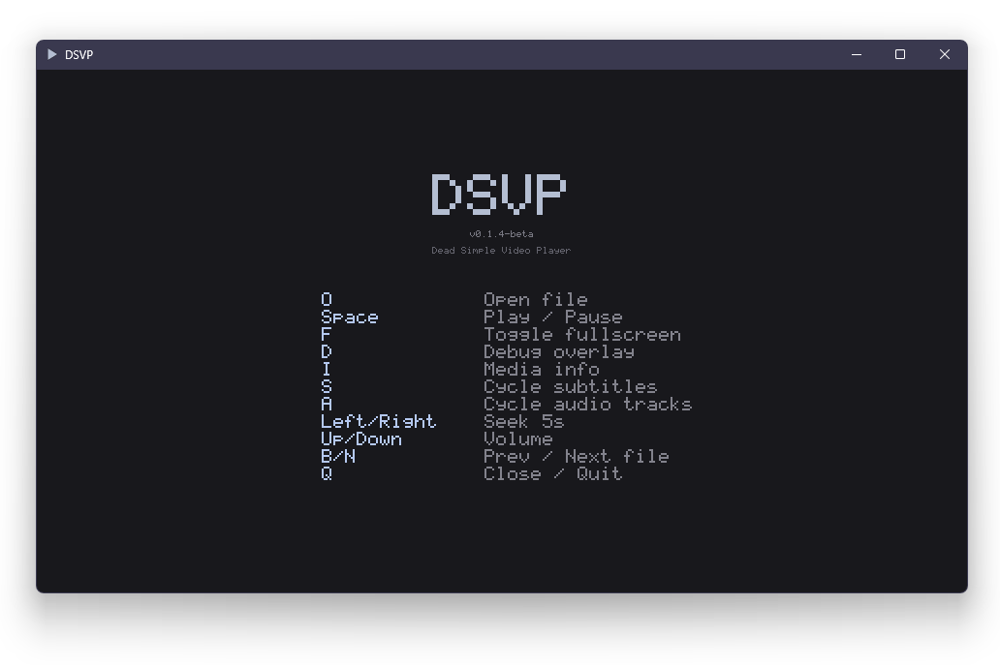

# DSVP_deck — Dead Simple Video Player for the Steam Deck




~~HDR is Coming Soon. Two weeks, tops. Maybe three. HDR is busted af on SteamOS 3.8~~

**HDR IS HERE IT'S REALLY HERE** (and you don't even have to enable it in Desktop Mode!)


A reference-quality video player purpose-built for the Steam Deck. Plug-and-play from Game Mode — no configs, no root, no reformatting your USB drives.

DSVP sits between VLC and mpv: better quality than VLC (modern FFmpeg, Lanczos scaling, temporal dithering, BT.2390 tone mapping), simpler than mpv (zero config, gamepad-native, best quality out of the box) — and on a Deck it does things neither does without a fight: real HDR output with automatic display switching, gamepad-first control in Game Mode, and bitstream passthrough to your TV. It plays anything FFmpeg supports.


This repo is for the **Steamdeck** build only, Windows & Debian builds [HERE](https://github.com/ASIXicle/DSVP).


**Bitstream passthrough is in and battle-tested — AC3 and DTS work end-to-end to the TV/AVR, zero setup.** The lossless formats (TrueHD, DTS-HD MA) are still the boss level: SteamOS can't yet carry high-bitrate IEC to the display — that one's on Valve's side of the wall, and DSVP falls back to PCM cleanly until then.

File Explorer:


---


## Highlights

- **USB / SD card auto-mount in Game Mode** — Plug in any NTFS, exFAT, or ext4 USB drive and it just works. DSVP auto-mounts via `udisksctl` (no root, no reformatting). Your drive appears as `[USB]` in the file browser.
- **Gamepad-native** — Full controller support: d-pad navigation, analog trigger seek (0–64× quadratic curve), **Start** for controls overlay, A/B/X/Y mapped to core functions. Works identically in Game Mode and Desktop Mode. Keyboard also supported.
- **Integrated file browser** — No external file dialogs. Navigate your files with d-pad or keyboard, rapid-scroll with held d-pad, page through directories. Stays within `/home/deck/` to keep things simple — external drives injected at the top level.
- **True HDR on an HDR display** — HDR10 / Dolby Vision / HLG content plays with real HDR output: PQ passthrough, the display tone-maps, and DSVP engages/reverts the display's HDR mode automatically per file. Desktop stays SDR. No settings.
- **Reference-quality playback** — Lanczos-2 luma (anti-ringing clamp), Catmull-Rom chroma (siting-corrected — including BT.2020's spec top-left default — with anti-ringing on HDR), temporal blue noise dithering, faithful color/gamma/framerate. Image quality is paramount.
- **VAAPI zero-copy** — HEVC decoded on the APU's VCN hardware, imported directly into Vulkan via DMA-BUF. Zero sustained drops on 4K content.
- **Game Mode + Desktop Mode** — Auto-detects environment, scales OSD (3× in Game Mode), 16:10 crop-to-fill in Game Mode, standard letterboxing in Desktop Mode.

## Features

- **HDR10 passthrough** — per-file HDR10/ST2084 swapchain, content PQ/BT.2020 code values untouched, automatic display HDR engage/revert; **Z** toggles passthrough ↔ tone-map live for an instant A/B against your TV. Static metadata (mastering display + MaxCLL/FALL, sanitized against inconsistent disc authoring) is staged for the compositor
- **HDR→SDR tone mapping** — BT.2390 EETF with dynamic scene-adaptive peak detection (99.875th percentile histogram, asymmetric temporal smoothing), adjustable SDR target (203/300/400 nits) and midtone gain (1.0–1.4) — the fallback and internal-panel path
- **HLG** — in-shader HLG→PQ conversion rides the same HDR paths
- **Dolby Vision** — Profile 5 decode with per-frame RPU updates and piecewise polynomial + MMR chroma reshaping; Profile 8 rides its backward-compatible HDR10 base layer
- **10-bit passthrough** — YUV420P10LE uploads as R16_UNORM planar textures, no truncation, no swscale
- **VAAPI hardware decode** — HEVC on the Deck's VCN engine (bit-exact P010 output), software decode for everything else
- **Supports everything FFmpeg supports** — H.264, HEVC, AV1, VP9, VC-1, MKV, MP4, Webm, and hundreds more
- **Display-aware frame pacing** — two-mode engine: vsync-locked at true 1:1, slot-assignment scheduling everywhere else. Drops/repeats are planned and evenly spaced against the measured display cadence, so A/V sync holds without stutter storms — even windowed, where compositors deliver fewer slots than the content needs
- **Adaptive thread tuning** — Per-codec/per-file thread selection optimized for the Deck's 4C/8T Zen 2
- **Full subtitle support** — Text (SRT, ASS/SSA) with up to 4 overlapping cues displayed at once (signs + dialogue, second speakers — anime-grade), bitmap (PGS, VobSub), CJK fallback fonts, golden yellow with black outline
- **Auto-play** — Sequential playback through folder contents
- **Portable** — Single folder, no installer, no root, survives SteamOS updates
- **Secure** — No networking capabilities whatsoever

## Controls

| Key            | Gamepad          | Function                                |
| -------------- | ---------------- | --------------------------------------- |
| O              | A (idle)         | Open integrated file browser            |
| Q              | B                | Close file / Quit (returns to browser)  |
| Space          | X                | Pause / resume                          |
| ← / →          | LB / RB          | Seek ±5 seconds                         |
| —              | LT / RT          | Analog seek (0–64× quadratic curve)     |
| ↑ / ↓ (play)   | D-pad U/D        | Volume                                  |
| ↑ / ↓ (browse) | D-pad U/D        | Navigate (hold for rapid scroll)        |
| ← / → (browse) | D-pad L/R        | Page up / Page down                     |
| Enter          | A (browse)       | Open file / Enter directory             |
| Backspace      | B (browse)       | Go up directory                         |
| B / N          | D-pad L/R (play) | Prev / Next file                        |
| S              | Y                | Cycle subtitle tracks                   |
| A-key          | R3               | Cycle audio tracks                      |
| P              | —                | Toggle bitstream passthrough / PCM      |
| D              | Back/Select      | Debug overlay                           |
| —              | Start            | Controls overlay (toggle)               |
| —              | L3               | Transport control mode (toggle)         |
| H              | —                | Cycle HDR debug views                   |
| T              | —                | Cycle SDR target nits (203 / 300 / 400) |
| G              | —                | Cycle midtone gain (1.0–1.4)            |
| E              | —                | Cycle output gamma (sRGB / 2.2 / 2.4)   |
| Z              | —                | Toggle HDR passthrough / tone-map (choice sticks for the session) |

## Installing on Steam Deck

See [SteamOS.md](SteamOS.md) for download, install, desktop/Game Mode setup, and display configuration.

## Building from Source on Steam Deck

See [SETUP.md](SETUP.md) for the full build-from-source walkthrough. The short version:

SteamOS has a read-only root filesystem and ships no development headers. Building from source requires unlocking the filesystem, installing dev tools via `pacman`, and building FFmpeg 9.0, SDL3, and SDL3_ttf from source into `~/` prefixes. The resulting portable tarball is self-contained and runs without any of the dev tools installed.

### Requirements

- **SteamOS** with filesystem unlocked (`sudo steamos-readonly disable`)
- **base-devel** (gcc, make, pkg-config) via `pacman`
- **FFmpeg 9.0** built from source with `--enable-vaapi`
- **SDL3 3.4.14** built from source (SETUP.md applies the bundled HDR-metadata patch from `tools/sdl-patches/`)
- **SDL3_ttf 3.2.2** built from source
- **SDL3_shadercross 3.0.0** (bundled in repo — not available via package managers)
- **libva + libva-utils** for VAAPI hardware decode
- **zlib** (for PGS subtitle decompression)

### Quick Build

```bash
cd ~/DSVP-build
export PKG_CONFIG_PATH=$HOME/ffmpeg-9.0-local/lib/pkgconfig:$HOME/sdl3-local/lib/pkgconfig:$PKG_CONFIG_PATH
./package.sh   # builds portable (no rpath), bundles libs, verifies the closure
rm -f DSVP-portable/dsvp.log
rm -rf ~/DSVP-old && mv ~/DSVP ~/DSVP-old && mv DSVP-portable ~/DSVP
```

`package.sh` does its own clean `make PORTABLE=1` and refuses to package a
dev-built (rpath-carrying) binary, then fails loudly unless every library
resolves from the bundle's own `lib/`. A plain `make` still produces a
dev binary that runs bare from the tree.

## Project Structure

```
DSVP-deck/
  src/
    dsvp.h         ← Central state struct, GPU uniforms, constants, declarations
    main.c         ← SDL init, event loop, frame pacing, hotkey handling, gamepad input
    player.c       ← Demux thread, video decode/display, GPU pipelines, HLSL shaders, VAAPI, seeking
    audio.c        ← Audio decode, resample, SDL3 audio stream, A/V clock, track cycling
    bitstream_pw.c ← PipeWire-native IEC 61937 bitstream passthrough (AC3/DTS to the TV/AVR)
    subtitle.c     ← Subtitle detection, decode, multi-cue text display, CJK fallback fonts
    overlay.c      ← GPU-composited overlays: bitmap font, seek bar, debug/info panels, OSD, subtitles
    browser.c      ← Integrated file browser, USB/SD auto-mount, path persistence, NFS timeout
    log.c          ← Crash-safe unbuffered file logger
    hdrwire.c      ← In-process DRM probe: logs the display's actual HDR infoframe
  tools/           ← IEC958 udev helper, standalone HDR wire probe, SDL HDR-metadata patches
  Makefile         ← Build (sources from src/, output in build/; PORTABLE=1 for bundle builds)
  package.sh       ← Linux packaging script (bundles, then verifies the library closure)
```

## Technical Details for Dorks


First, the part that matters: **on an HDR display, DSVP plays HDR as HDR** — actual PQ output, not an SDR conversion. A per-file HDR10/ST2084 swapchain carries the content's PQ/BT.2020 code values to the display untouched, the display does the tone mapping with its own full-strength hardware, and DSVP engages/reverts the display's HDR mode automatically per file — the desktop itself never leaves SDR, and there is nothing to configure. HDR10 static metadata is parsed, sanitized against the inconsistencies real discs ship, and staged through a bundled SDL patch into Mesa's color-management path — the final metadata-to-display hop lights up as the compositor's passthrough support matures, with no player changes needed. Every HDR session logs the display's actual wire infoframe (`HDRWIRE:` lines) for verification.

DSVP uses a custom GPU rendering pipeline built on SDL_GPU with HLSL shaders cross-compiled to SPIR-V via SDL3_shadercross 3.0.0. The fragment shader performs Lanczos-2 resampling on luma (16-tap windowed sinc with anti-ringing clamp at 0.8), Catmull-Rom bicubic interpolation on chroma (16-tap with sub-texel siting correction — BT.2020 content defaults to its spec top-left siting when the encode strips the VUI flag — plus tap-range anti-ringing on HDR content), limited→full range expansion, BT.601/BT.709/BT.2020 color matrix conversion, and temporal blue noise dithering (64×64 void-and-cluster texture, per-frame offset) — all in a single pass. Two sampler-variant pipelines keep this fast: fixed unrolled 4×4 kernels at 1:1 and upscale, footprint-dilated kernels bound only when actually downscaling (anti-moiré without taxing the common path). YUV420P and YUV420P10LE formats bypass `swscale` entirely; raw decoded planes upload directly to GPU textures.

When there's no HDR display in the chain (or you press **Z** to compare), the shader applies PQ EOTF, BT.2390 tone mapping with scene-adaptive dynamic peak detection (CPU-side histogram scan with asymmetric temporal smoothing), BT.2020→BT.709 gamut mapping, and configurable midtone gain. Dolby Vision Profile 5 content goes through per-frame RPU-driven piecewise polynomial reshaping before tone mapping. Profile 8 uses the standard HDR10 path via its backward-compatible base layer.

HEVC content on the Steam Deck uses VAAPI hardware decode via the APU's VCN engine. The zero-copy path imports VAAPI surfaces as Vulkan images via DMA-BUF interop (`VK_KHR_external_memory_fd`), eliminating GPU readback entirely for P010 content. Semi-planar UV is handled in-shader (`is_semiplanar` uniform). Any zero-copy failure falls back to CPU readback transparently. H.264 and AV1 content remains software decoded. The GPU backend is Vulkan-only on this branch.

USB and SD card auto-mount works via `udisksctl`, which is present on every SteamOS install and requires no root access. On browser open, DSVP scans `/dev/disk/by-id/` for unmounted USB and MMC partitions, mounts them to `/run/media/deck/<label>`, and injects them into the file browser as `[USB]` entries. NTFS, exFAT, and ext4 filesystems are all supported — users can plug in a drive straight from a Windows PC without reformatting.

Frame pacing is an explicit two-mode machine driven by a measured display heartbeat (median of presented-frame intervals). When the display genuinely delivers the content's cadence, LOCKED mode slaves to vsync — no drops, no corrections — entered only with settled A/V drift and exited by contract the moment measurements change. Everywhere else (windowed, 24p-on-60Hz, compositor turbulence) SCHEDULED mode assigns each frame to a display slot against a smoothed audio clock: drops and repeats are planned and evenly spaced rather than threshold-reactive, so sync holds without storms even when the compositor delivers fewer slots than the content needs. Audio is never resampled, stretched, or paused for pacing.

## Debug Build

```bash
make debug
```

Enables GPU validation layers, console output, verbose FFmpeg logging, and debug symbols. A `dsvp.log` file is written to the working directory.

## Environment Variables

| Variable | Effect |
|---|---|
| `DSVP_THREADS=N` | Override adaptive thread count (0 = FFmpeg auto) |
| `DSVP_HWDEC=0` | Disable VAAPI hardware decode, force software |
| `DSVP_PCM=1` | Force PCM audio decode (skip bitstream passthrough logic) |
| `DSVP_NO_SYS_HDR=1` | Never touch the display's HDR mode (tone-map only) |
| `DSVP_NO_HDR_META=1` | Don't stage HDR10 static metadata for the compositor |
| `DSVP_NO_DILATE=1` | Disable the dilated downscale sampler variant |
| `DSVP_OUTPUT_GAMMA=2.2` | Output transfer for tone-mapped content: `srgb` or any gamma 1.0–3.0 (the E key cycles sRGB/2.2/2.4 live) |
| `DSVP_DIAG=1` | Log every raw key/button event (input troubleshooting) |

## Troubleshooting

- **Fullscreen frozen on one frame, but audio/seeking/windowed all fine** — wedged TV or display-chain state, not the player: power-cycle the TV **at the wall** (30 s, not standby), then try another HDMI input, then reset the desktop display config. Survives reboots and OS updates because none of those touch TV state.
- **Player freezes when a network share drops** — media on NFS/SMB blocks inside the kernel when the network vanishes; every player behaves this way (mpv identically). Reconnect or wait for the mount to time out.
- **Windowed 60fps content drops frames** — desktop compositors deliver fewer presentation slots than 60fps needs in a window; that's structural, and pacing keeps A/V sync through it. Fullscreen plays clean.
- **Z toggle takes a few seconds on a TV** — that's the TV's own HDR mode switch and HDMI renegotiation, not the player. Note the Z choice sticks for the whole session across files, by design — press Z again to switch back.
- **A key "does nothing"** — run with `DSVP_DIAG=1` and check `dsvp.log`: every press is logged raw, so you can see whether the key arrived and what consumed it.

## AI Disclosure

Built with the assistance of Anthropic's Claude (Opus 4.6 through Fable 5)

## License

GPL v3 — see [LICENSE](LICENSE).

A commercial license is available for proprietary use — see [COMMERCIAL_LICENSE.md](COMMERCIAL_LICENSE.md).
